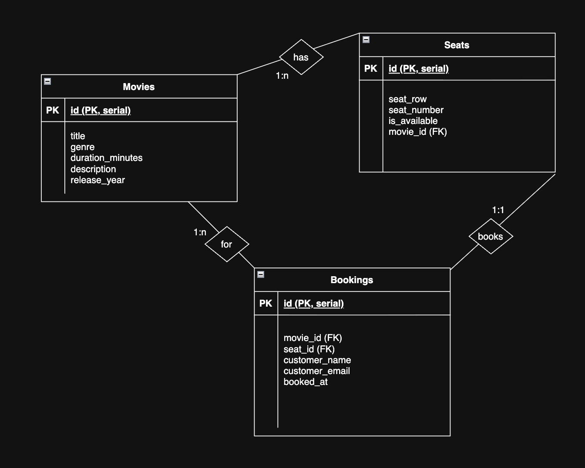
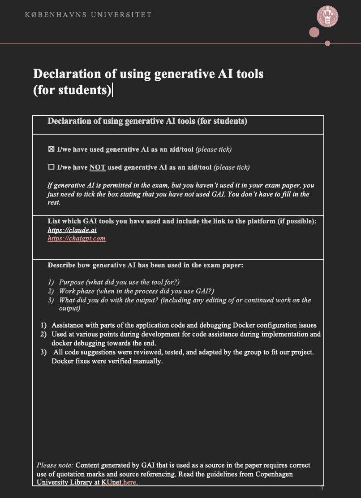

# Database-project
We have created a cinema booking web application with Flask and PostgreSQL, containerised with Docker.


## Requirements
[Docker Desktop](https://www.docker.com/products/docker-desktop/)

## Compilation and Setup

### 1. Clone the repository

```bash
git clone git@github.com:ym0c4/Database-project.git
cd Database-project
```

### 2. Build and start the containers

```bash
docker compose up --build
```

This starts two containers:
- web — the Flask application (which is accessible at http://localhost:5001)
- db — the PostgreSQL database


### 3. Initialise the database

The database needs to be seeded once after the containers are running. So open a second terminal window/tab and run:

```bash
docker compose cp schema.sql db:/schema.sql
docker compose cp seed.sql db:/seed.sql
docker compose exec db psql -U postgres -d cinema_db -f /schema.sql
docker compose exec db psql -U postgres -d cinema_db -f /seed.sql
```

This only needs to be done once as the data persists in a Docker volume (postgres_data) across restarts.


## Running the App

```bash
docker compose up
```

Copy paste this into your browser:
```bash
http://localhost:5001
```

To stop the app:
```bash
docker compose down
```
Or by clicking "stop" inside the docker desktop app. It is also possible to terminate by clicking "ctrl+c" inside the terminal window where we  "docker compose up --build" our project.

To stop and wipe the database (useful for a clean reset):
 
```bash
docker compose down -v
```


## Interacting with the App
1. Home page  — landing page
2. Now Showing  — browse all available films
3. Select Seats — view the seat map for a film and select a seat
4. Confirm Booking — enter your name and email to complete the booking; the seat is immediately marked as taken

## Database Model - E/R diagram 
We used the web version of draw.io to create our E/R diagram

PK - primary key
FK - Foreign key
Movies has seats (1:n meaning a movie has many seats)
Seats - Bookings (1 to 1, once a seat is booked it's marked unavailable, so each seat appears in at most one booking.)
Bookings - Movies (1:n many bookings reference the same movie (this is technically redundant given the Seats -> Movies path, but movie_id is stored directly in bookings for convenience))


## AI Declaration
